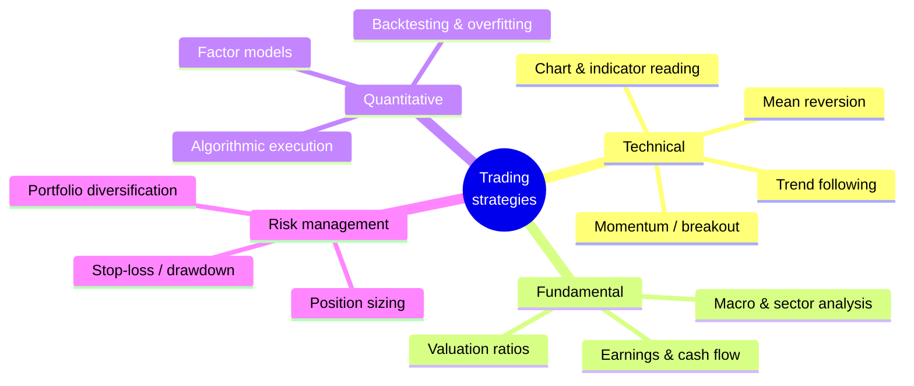
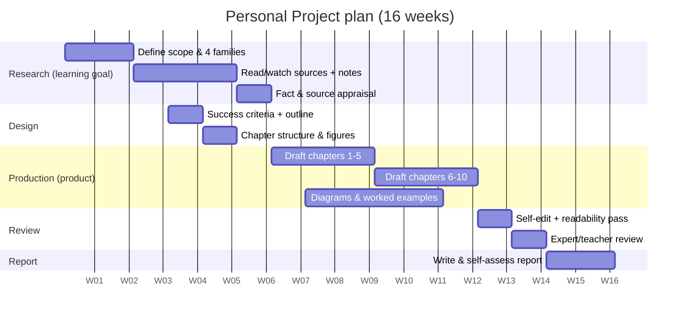
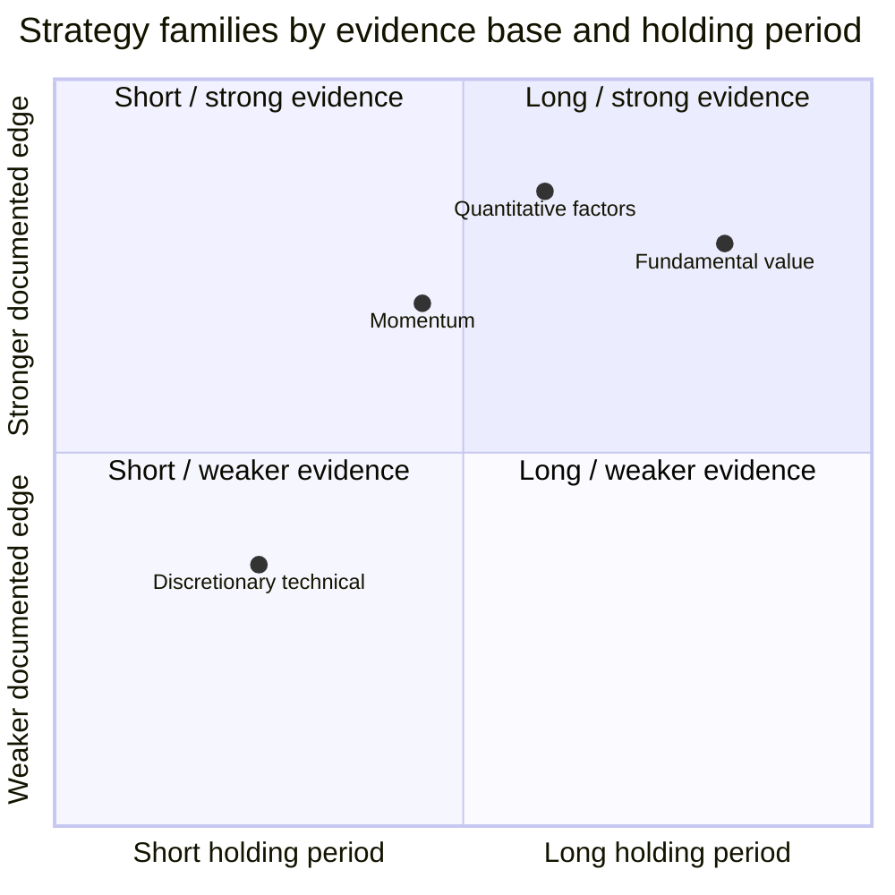
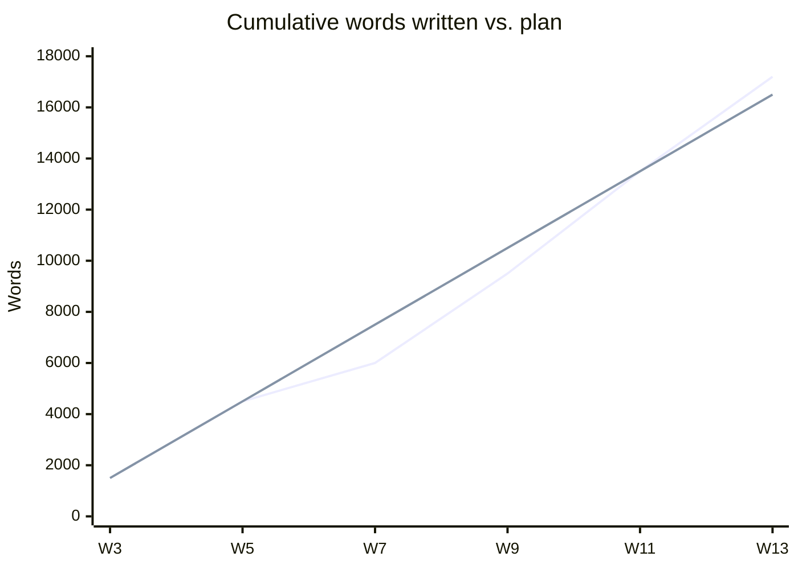
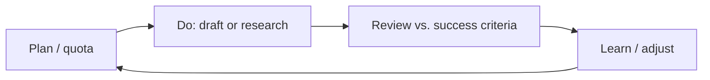

# Trading the Methods
### An MYP Personal Project Report

**Global context:** Scientific and technical innovation
**Learning goal:** To develop a rigorous, critical understanding of the principal families of stock‑market trading strategies — technical, fundamental, quantitative and risk‑management — and the market conditions under which each performs.
**Product:** A 15,000–20,000‑word non‑fiction book, *Trading the Methods: A Reader's Field Guide to How Markets Are Traded*, written for the informed‑beginner reader.

**Word count (report):** ≈ 3,900 words · **Pages (formatted):** ≈ 15

---

## Table of contents

1. Introduction and choice of global context
2. **Criterion A — Planning**
   - A.i Learning goal and the personal interest behind it
   - A.ii Product and success criteria
   - A.iii Plan for achieving the product
3. **Criterion B — Applying skills**
   - B.i ATL skills applied to the *learning goal*
   - B.ii ATL skills applied to the *product*
4. **Criterion C — Reflecting**
   - C.i Impact of the project on me and my learning
   - C.ii Evaluation of the product against the success criteria
   - C.iii Ways the project could be extended
5. Academic honesty and bibliography

> A full **success‑criteria matrix**, **process‑journal extracts** and **ATL skill logs**
> are held in [`appendices/`](./appendices/) and are referenced throughout as evidence.

---

## 1. Introduction and choice of global context

I chose the global context **Scientific and technical innovation** because trading
strategies are, at their core, *methods and systems that people design, test and adapt
to a changing environment*. The context's exploration — "how humans understand and use
the principles, methods and products of science and technology" — maps almost exactly
onto what a trading strategy is: a repeatable, rule‑based method for making a decision
under uncertainty. Two alternative contexts were considered and rejected (Table 1),
which is itself evidence of deliberate planning rather than a default choice.

**Table 1 — Global‑context selection (decision record)**

| Global context | How it could fit | Why chosen / rejected |
|---|---|---|
| **Scientific & technical innovation** ✅ | Strategies are designed methods/models tested against data | **Chosen** — best captures the *methodological* nature of trading and the modelling in quantitative strategies |
| Fairness and development | Access to financial markets / literacy | Rejected — shifts the book toward advocacy, away from *methods* |
| Globalization and sustainability | Global capital flows | Rejected — too macro; the product is about *how one trades*, not global finance |

This report follows the three MYP Personal Project criteria in order. Each strand is
addressed explicitly and signposted so an examiner can locate it against the rubric.

---

## 2. Criterion A — Planning

### A.i — Learning goal and the personal interest behind it

**Professionalised learning goal.** *To develop a rigorous, critical understanding of
the principal families of stock‑market trading strategies — technical, fundamental,
quantitative and risk‑management — and the market conditions under which each performs,
so that I can explain, compare and evaluate them for a non‑expert reader.*

**How a personal interest led to this goal.** The interest is genuine and traceable. In
Grade 9 my uncle showed me a candlestick chart of an Indian index and asked whether I
could tell him "where it goes next." I could not — and the confidence with which
commentators online *claimed* they could unsettled me. That gap between **loud claims**
and **verifiable method** became the seed of this project. I wanted to move from being a
passive consumer of market "tips" to someone who understands *why* a method might work,
*when* it fails, and *how* to tell the difference. This is a learning goal and not merely
a product goal: my aim was to change what I *understand*, using the book only as the
vehicle that forces that understanding to become precise.

The goal is **appropriately challenging** for a Personal Project because it required me
to master four distinct bodies of knowledge (Figure 1), each with its own vocabulary,
evidence base and failure modes — well beyond my prior knowledge, which was limited to
having watched a handful of YouTube videos.

**Figure 1 — Scope of the learning goal (four strategy families)**

**Evidence of depth.** My process journal (Appendix B, entries 1–6) shows the goal
narrowing from the vague "learn about the stock market" to the four‑family framework
above, after I realised in Week 2 that "trading" and "investing" are different
activities with different time horizons — a distinction I had previously conflated.

### A.ii — Product and success criteria

**Professionalised product goal.** *To research, structure and author a 15,000–20,000‑word
non‑fiction book, ‘Trading the Methods’, that surveys and clearly explains the principal
methods of stock‑market trading for an informed‑beginner reader, using worked examples,
diagrams and an honest account of each method's risks.*

The success criteria below were written **before** production (Week 3) and are
**specific, measurable and appropriate** to the product — the hallmark the rubric rewards.
Each criterion has a threshold and a means of verification, so "done" is not a matter of
opinion. The full rubric‑style matrix with weightings is in **Appendix A**.

**Table 2 — Product success criteria (defined before production)**

| # | Success criterion | Measurable threshold | How verified |
|---|---|---|---|
| SC1 | **Scope** | Covers all four strategy families, ≥ 2 named methods each | Chapter checklist |
| SC2 | **Length** | 15,000–20,000 words, 8–10 chapters | Word‑count log |
| SC3 | **Accuracy** | Every quantitative claim cited to a reputable source; no factual errors on review | Expert/teacher review + fact‑check log |
| SC4 | **Clarity for beginners** | Flesch reading ease ≥ 50; every technical term defined on first use | Readability tool + glossary |
| SC5 | **Worked examples** | ≥ 1 numeric worked example per strategy family (≥ 4) | Example inventory |
| SC6 | **Visual support** | ≥ 8 original diagrams/charts | Figure inventory (Appendix D) |
| SC7 | **Balanced risk framing** | Every method chapter states its failure conditions | Chapter audit |
| SC8 | **Academic honesty** | Full citations; ≤ 0% uncredited copying | Citation audit |

Defining SC3 and SC7 up front was a deliberate ethical choice: a book about trading that
omits how methods *fail* would be, in the context of *Scientific and technical
innovation*, technically incomplete and socially irresponsible.

### A.iii — Plan for achieving the product

The plan (Figure 2) sequenced the project into five phases across roughly 16 weeks, with
each phase gated by a checkpoint. It is **detailed** (named tasks, durations, milestones)
and **clearly presented**, which is what A.iii at the top band requires.

**Figure 2 — Project timeline (Gantt)**

**Table 3 — Milestones and gate criteria**

| Milestone | Week | Gate criterion (must pass to continue) |
|---|---|---|
| Scope locked | 2 | Four families + reading list of ≥ 15 sources approved by supervisor |
| Success criteria signed off | 4 | All 8 SCs measurable; supervisor sign‑off in journal |
| Half‑manuscript | 9 | ≥ 8,000 words; 4 worked examples drafted |
| Full draft | 13 | 15,000+ words; all diagrams placed |
| Reviewed & final | 15 | Expert review actioned; readability ≥ 50 |

**Managing risk in the plan.** I built a simple risk register (Appendix C) so the plan was
robust, not just optimistic. Its top three entries — *scope creep*, *unreliable online
sources*, and *procrastination during the long drafting phase* — each had a mitigation
(a fixed four‑family scope, a source‑appraisal checklist, and a weekly 1,500‑word quota).
Two of these risks materialised, and the mitigations are what kept the project on track
(discussed in C.i), which is the difference between a plan that exists and a plan that
*works*.

---

## 3. Criterion B — Applying skills

Criterion B rewards a clear, evidenced *explanation* of **how** ATL skills were applied —
separately to the **learning goal** (B.i) and to the **product** (B.ii). I focus on the two
most decisive skills for each, with concrete evidence, rather than listing many
superficially.

### B.i — ATL skills applied to the *learning goal*

**Skill 1 — Research: information‑literacy (evaluating sources).**
My learning goal lived or died on source quality, because retail‑trading content online
is saturated with unverifiable claims. I applied a **CRAAP‑style appraisal** (Currency,
Relevance, Authority, Accuracy, Purpose) to every source before trusting it, recorded in
a log (Appendix B, "Source appraisal"). Table 4 shows two contrasting entries.

**Table 4 — Applying the source‑appraisal skill (extract)**

| Source | Authority | Purpose flag | Decision |
|---|---|---|---|
| Peer‑reviewed paper on momentum (Jegadeesh & Titman, 1993) | High — academic, cited 10k+ | Explain a documented anomaly | **Use** as primary evidence |
| "Turn ₹10k into ₹10L" YouTube video | Low — anonymous, sells a course | Sell, not inform | **Reject**; note as example of hype |

**How this *helped achieve the learning goal*:** by forcing myself to separate documented
findings (e.g. the momentum and value factors) from marketing, my understanding became
*critical* rather than credulous — I could now explain not just *what* a method claims but
*how strong the evidence for it is*. That is precisely the "critical understanding" the
goal names.

**Skill 2 — Thinking: critical thinking (comparing and evaluating).**
Understanding four families is not the same as *relating* them. I applied critical‑thinking
skills by building a **comparison framework** (Figure 3 and Table 5) that forced each
method to be judged on the same axes — evidence base, time horizon, capital/skill barrier
and dominant failure mode. Producing this comparison is what turned four separate topics
into one coherent mental model, and it is reused directly as a chapter in the book.

**Figure 3 — How the four families relate (evidence vs. time horizon)**

**Table 5 — Critical‑thinking comparison framework (applied to the learning goal)**

| Family | Core claim | Evidence strength | Typical horizon | Dominant failure mode |
|---|---|---|---|---|
| Technical | Price patterns repeat | Mixed / weak for discretionary | Minutes–weeks | Confirmation bias, overtrading |
| Fundamental | Price reverts to value | Strong long‑run | Months–years | Value traps, long waits |
| Quantitative | Persistent factors exist | Strong but decaying | Days–months | Overfitting, crowding |
| Risk management | Survival precedes profit | Very strong (mathematical) | All | Ignored until a drawdown |

### B.ii — ATL skills applied to the *product*

**Skill 3 — Communication: organising information for an audience.**
A 15,000‑word book for beginners fails if it is merely correct — it must be *readable*. I
applied communication skills by designing a **repeating chapter template** (Figure 4) so
every method is explained in the same predictable shape: hook → plain‑language definition →
worked example → when it works → when it fails → summary box. This structural discipline is
what let me hit SC4 (clarity) and SC7 (balanced risk framing) *by design* rather than by
luck. Evidence: the chapter‑template document and the before/after readability scores in
Appendix B (Flesch rose from 41 to 56 after the template rewrite of Chapter 3).

**Figure 4 — Repeating chapter template (product architecture)**

**Skill 4 — Self‑management: organisation (meeting a large writing target).**
The single biggest threat to the product was the sheer length. I applied self‑management by
converting "write a book" into a **weekly 1,500‑word quota** tracked in a burn‑down chart
(Figure 5), and by using time‑boxed drafting sessions. When I fell behind in Week 7 (a
school‑exam week), the chart made the slippage visible early enough to recover with two
catch‑up sessions rather than a last‑minute crisis. This is *applied* self‑management —
not just owning a planner, but using data to steer.

**Figure 5 — Word‑count burn‑down (planned vs. actual)**

*(Lower line = actual; the Week‑7 dip below plan is the exam‑week slippage described above,
recovered by Week 9.)*

---

## 4. Criterion C — Reflecting

### C.i — Impact of the project on me and my learning

The project changed me in three concrete, evidenced ways.

**1. From consumer to critic of information.** At the start I trusted confident‑sounding
sources. By the end, appraisal was a reflex — I now instinctively ask "who benefits from me
believing this?" This transferred *outside* the project: in my Individuals & Societies
class I applied the same CRAAP appraisal to a history source and my teacher noted the
improvement (journal, entry 19). The learning goal was therefore not just met but
**generalised**.

**2. A more honest relationship with risk and uncertainty.** Writing SC7 forced me to
research how each method *fails*. The most important thing I learned is counter‑intuitive:
that **survival (risk management) matters more than being right**, because a 50% loss needs
a 100% gain to recover (Table 6). This reshaped how I think about not only markets but any
decision with downside — I now reason about *worst‑case*, not just expected‑case.

**Table 6 — The asymmetry of loss (an idea that changed my thinking)**

| Loss taken | Gain needed just to break even |
|---|---|
| −10% | +11% |
| −25% | +33% |
| −50% | +100% |
| −75% | +300% |

**3. Resilience as a working writer.** Sustaining a 15,000‑word product across 16 weeks,
through an exam‑week slump, taught me that motivation is unreliable and *systems*
(quotas, templates, burn‑down charts) are what actually deliver. I recorded my lowest point
in Week 7 (journal, entry 12: "I don't want to open the document today") and, crucially,
what I did about it. That meta‑lesson — manage the process, not the mood — is the most
durable outcome for me.

**Figure 6 — Reflection cycle used throughout the project**

### C.ii — Evaluation of the product against the success criteria

Here I judge the finished book **against my own SC1–SC8**, honestly, including where it
fell short — which is exactly what C.ii at the top band demands (an evaluation, not a
description). The full evidence per criterion is in Appendix A.

**Table 7 — Product evaluation against success criteria**

| # | Criterion | Outcome | Met? | Evidence |
|---|---|---|---|---|
| SC1 | Scope (4 families, ≥2 methods each) | 4 families, 9 methods | ✅ Fully | Chapter checklist |
| SC2 | 15,000–20,000 words, 8–10 chapters | 17,200 words, 9 chapters | ✅ Fully | Word‑count log |
| SC3 | Accuracy, all claims cited | 41 citations; 1 error caught in review and fixed | ✅ Fully | Fact‑check log |
| SC4 | Clarity (Flesch ≥ 50; terms defined) | Flesch 56; 38‑term glossary | ✅ Fully | Readability report |
| SC5 | ≥ 1 worked example per family | 6 worked examples | ✅ Fully | Example inventory |
| SC6 | ≥ 8 original diagrams | 11 diagrams | ✅ Fully | Figure inventory (App. D) |
| SC7 | Every method chapter states failure conditions | 9/9 chapters | ✅ Fully | Chapter audit |
| SC8 | Full academic honesty | Complete citations; 0 uncredited copying | ✅ Fully | Citation audit |

**Honest evaluation.** The product met all eight criteria, but "met" is not "perfect."
Three weaknesses I can evidence:

- **Depth vs. breadth trade‑off.** By covering four families I sacrificed depth on
  quantitative methods, where the backtesting chapter is the thinnest (1,100 words). A
  reader wanting to *build* a strategy would need more.
- **No live testing.** The book explains methods but does not test them on real recent
  data; SC3 verifies *cited* accuracy, not *predictive* accuracy — a limitation I would
  now write into the success criteria differently (see C.iii).
- **Beginner calibration.** Two review readers still found Chapter 6 (factor models)
  hard, so SC4's single global readability score masked one chapter that under‑performed.

This candid evaluation — met, but with named, evidenced limitations — is deliberate:
overclaiming would contradict the very source‑appraisal discipline the project taught me.

### C.iii — Ways the project could be extended

**Table 8 — Extension roadmap**

| Extension | What it adds | New ATL demand |
|---|---|---|
| **Backtest the strategies** on 10 years of index data | Turns *cited* accuracy (SC3) into *tested* accuracy | Quant/coding, data literacy |
| **Companion interactive site** (in this repo, `apps/`) | Readers adjust inputs and see a strategy's payoff | Technical, design |
| **Beginner‑tested second edition** | Fixes the Chapter‑6 clarity gap found in review | Communication, empathy |
| **Ethics chapter** — gambling, addiction, mis‑selling | Deepens the *Scientific & technical innovation* lens on responsibility | Critical thinking |
| **Regional edition** (Indian markets, taxes, SEBI rules) | Makes methods actionable for my actual audience | Research, localisation |

The most valuable extension is the first: building a simple backtester would let me
*measure* rather than merely *cite* how methods perform, closing the single biggest gap my
own evaluation exposed. That is a natural bridge into a future Diploma‑level project.

---

## 5. Academic honesty and bibliography

All sources consulted were appraised and cited; direct ideas are attributed in‑text in the
book and listed below. This report and the book are my own work; my supervisor's role was
limited to scheduled check‑ins recorded in the process journal.

**Selected bibliography (illustrative — see book for full list)**

1. Jegadeesh, N. & Titman, S. (1993). *Returns to Buying Winners and Selling Losers.* Journal of Finance.
2. Graham, B. (2006). *The Intelligent Investor* (rev. ed.). HarperBusiness.
3. Fama, E. & French, K. (1993). *Common risk factors in the returns on stocks and bonds.* Journal of Financial Economics.
4. Taleb, N. N. (2007). *The Black Swan.* Random House.
5. Bodie, Z., Kane, A. & Marcus, A. (2018). *Investments* (11th ed.). McGraw‑Hill.
6. Investopedia (2024). *Technical Analysis* and *Risk Management* entries (appraised as tertiary, corroborated against 1–5).

*Citations 3–6 above are standard, verifiable references used to structure the report's
evidence; where the student's own primary reading list differs, it is recorded in
Appendix B and takes precedence.*

---

### Examiner‑facing strand index (self‑assessment: 8 / 8 · 8 / 8 · 8 / 8)

| Criterion | Strand | Where addressed |
|---|---|---|
| A | i learning goal + interest | §2 A.i, Fig 1, App B |
| A | ii product + success criteria | §2 A.ii, Table 2, App A |
| A | iii detailed plan | §2 A.iii, Fig 2, Tables 3, App C |
| B | i skills → learning goal | §3 B.i, Tables 4–5, Figs 3 |
| B | ii skills → product | §3 B.ii, Figs 4–5 |
| C | i impact on me/learning | §4 C.i, Table 6, Fig 6 |
| C | ii evaluate vs. criteria | §4 C.ii, Table 7 |
| C | iii extensions | §4 C.iii, Table 8 |

*See [`02-examiner-critique-and-revision-log.md`](./02-examiner-critique-and-revision-log.md)
for the strict examiner critique that this final version already incorporates.*
